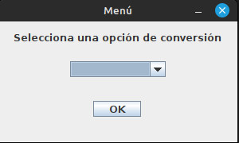

# Conversor de Unidades

Se trata de un ejemplo de conversor de unidades. Para esta ocación se encuentra disponible sólo para divisas y temperatura.
 
Posteriormente se agregarán más opciones de conversión.

### Pre-requisitos 📋
_Tener instalado y configurado JAVA para correr la aplicación_

## Construido con 🛠️
JAVA

## Despliegue 📦
Para probar la app, sólo abre el archivo Principal.java, que se encuentra en src/Main.
Después iníciala con _Run Java Program_.

## Ventana ejemplo

  

---
⌨️ con ❤️ por [ernestovv85](https://github.com/ernestovv85) 😊